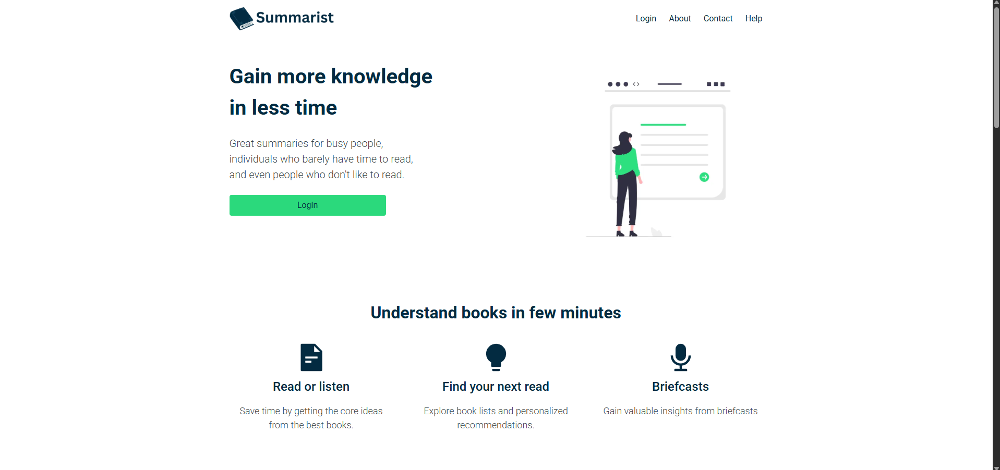
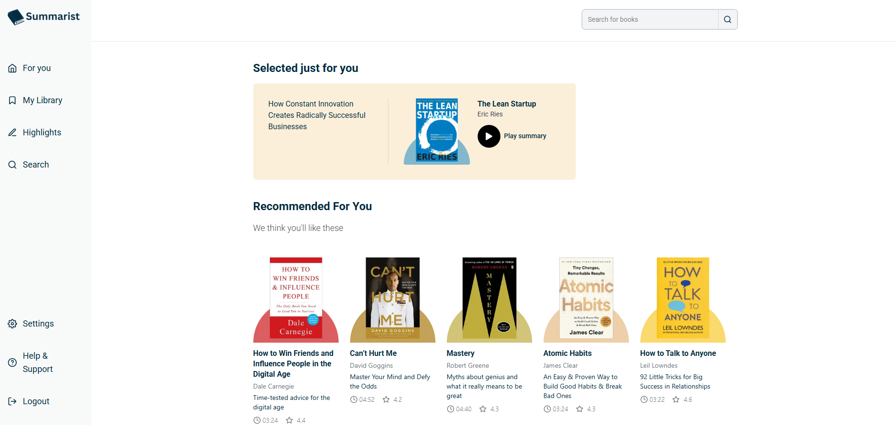
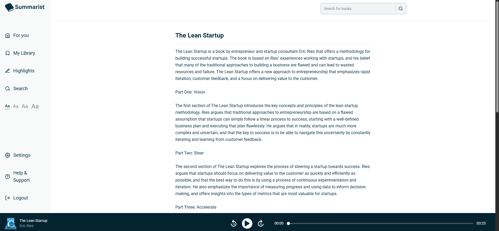
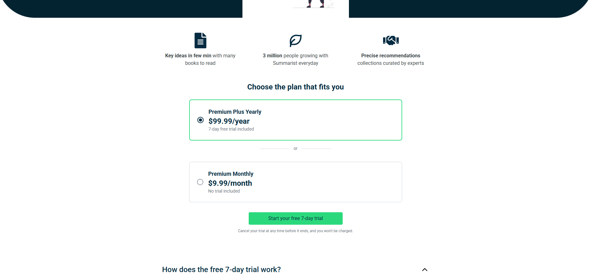

# Summarist

A subscription book-summary app where users browse, save, read, and listen to book summaries, with premium content unlocked through Stripe billing.

**[Live site →](https://summarist-rose-psi.vercel.app/)**

## The problem

Build a complete subscription product from a design and a written brief: user accounts, premium-only content, an audio player, a personal library, and recurring billing with a free trial.

## My contribution

Solo build, built as the capstone project for my frontend program. I built every page and feature:

- Authentication with email and password, Google sign-in, guest access, and password reset
- Premium gating: logged-out users are prompted to sign in, and free users are sent to the plans page
- Monthly and yearly Stripe plans, with a 7-day free trial on the yearly plan
- A custom audio player with a styled seek bar, 10-second skip controls, and adjustable summary text size
- A personal library that syncs in real time, with Saved and Finished sections
- Debounced search, skeleton loading states, and a responsive sidebar that becomes an animated drawer on mobile

## Tech stack

- **Frontend:** Next.js (App Router), TypeScript, Tailwind CSS, Redux Toolkit, React Icons
- **Backend:** Firebase Authentication, Cloud Firestore
- **Payments:** Stripe, through the Firebase "Run Payments with Stripe" extension
- **Hosting:** Vercel

## Screenshots






## Technical decisions

### Stripe through a Firebase extension instead of a custom payment backend
The extension handles checkout sessions, webhooks, and syncing subscription status into Firestore, so the app never needs its own server to talk to Stripe. The tradeoff is less control over the payment flow. The 7-day trial is set per checkout session with `trial_period_days`, after Stripe's dashboard-level trial feature turned out to need an extra $0 price.

### Subscription tier derived from Stripe price IDs
Instead of storing a simple "isPremium" flag, the app reads the user's active subscription from Firestore and matches its price against known Stripe price IDs to work out their plan (Basic, Premium, or Premium Plus). The source of truth stays in Stripe's data rather than a flag that could fall out of sync.

### Server components and route-level loading states
Book and player pages fetch their data in server components, and `loading.tsx` files show skeletons shaped like each page while that fetch runs. Next.js handles the loading state automatically, without manual loading flags in every component.

### A ref to keep the audio player stable
An early version recreated the `Audio` object on every render, because an inline `onEnded` callback changed each time and was listed as an effect dependency. Storing the callback in a ref, updated by its own small effect, means the audio object is only created when the track changes.

## Accessibility and testing

- Semantic headings and landmarks, labeled icon buttons, and visible focus states <!-- TODO: confirm -->
- The mobile drawer and overlay stay mounted and animate with CSS transforms, so opening and closing is smooth
- Responsive layouts were tested in a real, manually resized browser window, not only in DevTools device mode, which gave false width readings during development
- Core flows tested by hand: sign-up, sign-in, guest access, subscribing in Stripe test mode, gated content, saving to the library, and finishing a book
- **No automated test suite yet.** Adding tests for the auth and checkout flows is the next step.

## Setup

```bash
git clone https://github.com/brenthippler-art/summarist.git
cd summarist
npm install
```

Create a `.env.local` file with your own Firebase project's values:

```
NEXT_PUBLIC_FIREBASE_API_KEY=
NEXT_PUBLIC_FIREBASE_AUTH_DOMAIN=
NEXT_PUBLIC_FIREBASE_PROJECT_ID=
NEXT_PUBLIC_FIREBASE_STORAGE_BUCKET=
NEXT_PUBLIC_FIREBASE_MESSAGING_SENDER_ID=
NEXT_PUBLIC_FIREBASE_APP_ID=
```

Then run:

```bash
git clone https://github.com/brenthippler-art/summarist.git
cd summarist
npm install
npm run dev
```

The full checkout flow also needs the Stripe extension installed on your Firebase project, with your own Stripe test keys.

## Live link

[summarist-rose-psi.vercel.app](https://summarist-rose-psi.vercel.app/)

## Author

**Brenton Hippler:** [Portfolio](https://brentoncodes.dev) · [LinkedIn](https://www.linkedin.com/in/brenton-hippler-818b6397) · [GitHub](https://github.com/brenthippler-art)